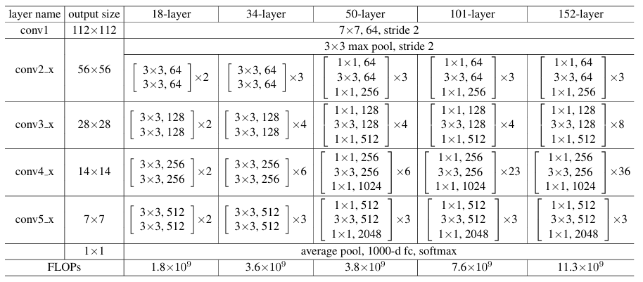

## Abstract
This report details the approach used to fine-tune three convolutional neural networks—Microsoft ResNet-18, Microsoft ResNet-101, and ConvNeXt—pretrained on ImageNet, for image classification on the Caltech-101 dataset. We leverage the Hugging Face transformers APIs to load and preprocess data, split the dataset into 80 % training and 20 % validation, and replace each model’s final classification head with a new 101-way output layer. Pretrained weights initialize all layers except the new head, which is trained from scratch; the backbone layers are fine-tuned using a smaller learning rate. Our best model, ConvNeXt-Base-224, achieved a final validation accuracy of **97.1 %**.

The full training and evaluation code is available on GitHub:  
[caltech101-finetune repository](https://github.com/jinluo12345/DATA130051.01-PJ2-1)

The pretrained model weights can be downloaded from Google Drive:  
[ConvNeXt-Base-224 weights](https://drive.google.com/drive/folders/1Vf8daBp855dEcveelM7qRBrggMueS6uo?usp=sharing)

## 1. Model Architectures

### 1.1 ResNet-18
- **Depth & Blocks**: 18 layers total, including 8 residual blocks.  
- **Residual Connections**: Identity shortcuts bypass two convolutional layers to ease gradient flow.  
- **Modifications**  
  1. Replace the original 1000-way fully connected layer with a new nn.Linear(in_features=512, out_features=102).  
  2. Initialize all except the new head from microsoft/resnet-18 pretrained weights.  
  3. Optionally freeze the first N residual blocks, unfreeze subsequent blocks and the new head for fine-tuning.

### 1.2 ResNet-101

- **Depth & Blocks**: 101 layers, organized in 33 residual blocks for higher representational power.  
- **Bottleneck Design**: Each block uses 1×1, 3×3, then 1×1 convolutions to reduce parameters.  
- **Modifications**  
  1. Swap the final classifier for nn.Linear(in_features=2048, out_features=102).  
  2. Load backbone weights from microsoft/resnet-101.  
  3. Freeze early layers; fine-tune latter layers plus new head with a reduced learning rate.

### 1.3 ConvNeXt

**Architecture**: Modernized CNN inspired by Vision Transformers.
**Key Features**:
- Four stage-wise blocks with depthwise and pointwise convolutions.
- Large 7×7 depthwise kernels for expanded receptive fields.
- LayerNorm replacing BatchNorm.
**Modifications**:
- Load `facebook/convnext-tiny-224` pretrained weights.
- Replace final `nn.Linear(768, 1000)` with `nn.Linear(768, 102)`.
- Freeze first two stages; fine-tune last two stages and head at LR=1e-4 (backbone) and 1e-3 (head).

## 2. Dataset Overview

The Caltech-101 dataset contains 9,144 images spanning 102 categories (101 object classes plus one “BACKGROUND_Google” class). Images vary in size (roughly 100×100 to 300×300 pixels) and channel depth (≈411 grayscale, ≈8,733 RGB). Category folders are named after their class (e.g., `accordion`, `airplanes`, `zebra`, `BACKGROUND_Google`), with 40–800 images per class (average ≈90 images). Some examples are as follows.

Data is split in a stratified, per-class fashion: 80% for training and 20% for validation. All images are resized so that the shorter side is 256 px, center-cropped to 224 × 224 px, and normalized using ImageNet’s mean and standard deviation. Grayscale images are converted to three-channel by duplication. 

## 3. Experiments
### 3.1 Settings

If not specially pointed, by default, each experiment is run with a batch size of 128 and a fixed random seed of 42. We train for 50 epochs, splitting Caltech-101 into 80 % training and 20 % validation per class. All three architectures (`microsoft/resnet-18`, `microsoft/resnet-101` and `facebook/convnext-tiny-224`) are initialized with ImageNet-pretrained weights, replacing only the final classification head to output 102 classes.

If not specially pointed, optimization uses SGD with momentum 0.9 and a small weight decay of 1e-4. The newly added head parameters are trained at a base learning rate of 1e-3, while all backbone parameters are fine-tuned at one-tenth of that rate (i.e., 1e-4). No learning-rate scheduler is applied by default. Cross‐entropy loss is used throughout.

Data loading relies on Hugging Face `datasets`. During training we first ensure it’s in RGB, then perform a RandomResizedCrop to 224×224 to learn scale‐ and translation‐invariant features. Finally, we convert to a PyTorch tensor and normalize using ImageNet’s mean [0.485, 0.456, 0.406] and standard deviation [0.229, 0.224, 0.225]. Unless specially mentioned, We do not use data augmentation. 

All the experiments results are shown in Table below:
| Index            | Model              | Pretraining | Training Accuracy | Validation Accuracy | Model Size (MB) | Batch size | augmentation |
|:----------------:|:-------------------|:------------|:-----------------:|:-------------------:|:---------------:|:----------:|:----------:|
|  1(Pretrained)   | ResNet-18          | No          |        1.00       |        0.589         |       44        | 128      |      No |
|  2               | ResNet-18          | Yes         |        1.00       |        0.951         |       44        | 128      |      No |
|  3(arch)         | ResNet-101         | Yes         |        0.956      |        0.912         |      178        | 128      |      No |
|  4               | convnext-tiny-224  | Yes         |        1.00       |        0.966         |      114        | 128      |      No |
|  5(aug)          | ResNet-18          | Yes         |        0.913      |        0.852         |       44        | 128      |     Yes |
|  6(batch)        | ResNet-18          | Yes         |        1.00       |        0.945         |       44        | 256      |      No |
|  7               | ResNet-18          | Yes         |        1.00       |        0.954         |       44        | 64       |      No |
|  8               | ResNet-18          | Yes         |        1.00       |        0.957         |       44        | 32       |      No |

### 3.2 Pretrained or Not

In this experiment, we compare two ResNet-18 variants—one initialized with ImageNet-pretrained weights and one trained entirely from scratch on Caltech-101—while keeping all other hyperparameters, data augmentations, and training schedules identical. This controlled comparison isolates the effect of large-scale pretraining on convergence speed and final classification accuracy in a small, fine-grained dataset setting.
The training curve are shown below:

**Figure Description**: The plot shows that the ResNet-18 model initialized with ImageNet-pretrained weights achieves over 0.90 validation accuracy, while the model trained from scratch on Caltech-101 only reaches about 0.60; although both models reach nearly 1.00 training accuracy, the non-pretrained model exhibits clear overfitting, with its validation accuracy stagnating and even declining after a certain point, demonstrating that pretraining on a large-scale dataset substantially accelerates convergence on a smaller, fine-grained dataset and significantly improves generalization, whereas training from scratch allows the model to memorize the training set but fails to learn robust features, leading to poor validation performance and severe overfitting, highlighting the importance of leveraging pretrained weights when working with limited data for fine-grained classification tasks.

### 3.3 Different Architectures

In this set of experiments, we evaluate the relative performance of three distinct CNN backbones—ResNet-18, ResNet-101, and convnext-tiny-224 fine-tuned under identical training protocols. By holding hyperparameters, data splits, and augmentation pipelines constant, we isolate how network depth, residual bottlenecks, and legacy fully-connected designs affect convergence speed, feature generalization, and final classification accuracy on Caltech-101.
The training curve are shown below:

**Figure Description**: The plot shows the training and validation accuracy of three different CNN backbones—ResNet-18, ResNet-101, and convnext-tiny-224—fine-tuned on the Caltech-101 dataset with identical training protocols. The convnext-tiny-224 model achieves the best performance, reaching around 0.96 accuracy, while ResNet-18 performs well with an accuracy of approximately 0.94. However, ResNet-101, even after 300 epochs of training, struggles to outperform both the convnext and ResNet-18 models, showing relatively lower accuracy.

The results suggest that convnext-tiny-224, with its more recent architecture and design, is better suited for the Caltech-101 dataset, ResNet-18, being a smaller model, seems to strike a good balance between model size and feature extraction, leading to solid performance. On the other hand, ResNet-101, while deeper, does not seem to benefit as much from its increased depth in this case. The large number of parameters in ResNet-101 could lead to difficulties in learning robust features, possibly due to overfitting or inefficiencies in training, which could explain why it lags behind the other models.

### 3.4 Augmentation or Not

To quantify the impact of data augmentation, we compare model training with our full augmentation pipeline (RandomResizedCrop, horizontal flip, ColorJitter, and random rotation) against a baseline that only performs center-cropping and normalization. This ablation highlights how synthetic variability influences robustness to lighting, scale, and orientation changes in a small-object recognition setting. We uses a 50%‐probability horizontal flip followed by the resize step to capture left–right variations. We further perturb appearance via ColorJitter (±40% brightness, contrast, and saturation) and rotate the image randomly within ±15° to improve robustness to lighting and orientation changes.

**Figure Description**: The plot compares validation accuracy between the baseline pipeline (center-crop + normalization) and the full augmentation pipeline (RandomResizedCrop, horizontal flip, ColorJitter, random rotation) over 300 epochs.  
Introducing synthetic variability through random cropping, horizontal flipping, color jitter (±40%), and ±15° rotation yields a noticeable decline in validation accuracy, it may because the pretrained model already has a good performance.

### 3.5 Batch Size

We investigate the effect of batch size by training ResNet-18 using three different batch sizes—32, 64, and 128—while keeping all other settings unchanged. This comparison sheds light on the trade-offs between gradient estimate stability, training time per epoch, and final validation accuracy when scaling memory and compute constraints.

- **Smaller batch sizes yield higher validation accuracy**: batch=32 achieves 0.957, batch=64 reaches 0.954, and batch=128 gives 0.951.  It may because the training steps are more.

**Figure description**: With batch sizes of 32 and 64, the validation loss curves show a sharp initial decline followed by a rebound, whereas the batch=128 loss curve is smoother but corresponds to a slightly lower final accuracy—indicating that smaller batches can explore the parameter space more effectively but may require learning‐rate or regularization adjustments to stabilize training.  

## 4. Best Model and Visualization

We trained a baet val model using ConvNext-Base-224 pretrained weights and trained for 500 epochs. The val accuracy can reach 0.97.
| Index            | Model              | Pretraining | Training Accuracy | Validation Accuracy | Model Size (MB) | Batch size | augmentation |
|:----------------:|:-------------------|:------------|:-----------------:|:-------------------:|:---------------:|:----------:|:----------:|
|  1   | ConvNext-Base-224         | Yes          |        1.00       |        0.971         |       354M        | 32      |      No|

The training and validating loss and accuracy are shown in the figure below: 

All the tensorboard curve are shown in the picture below:

